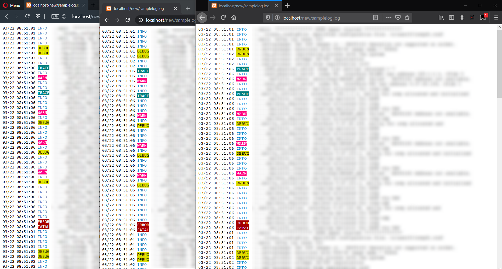
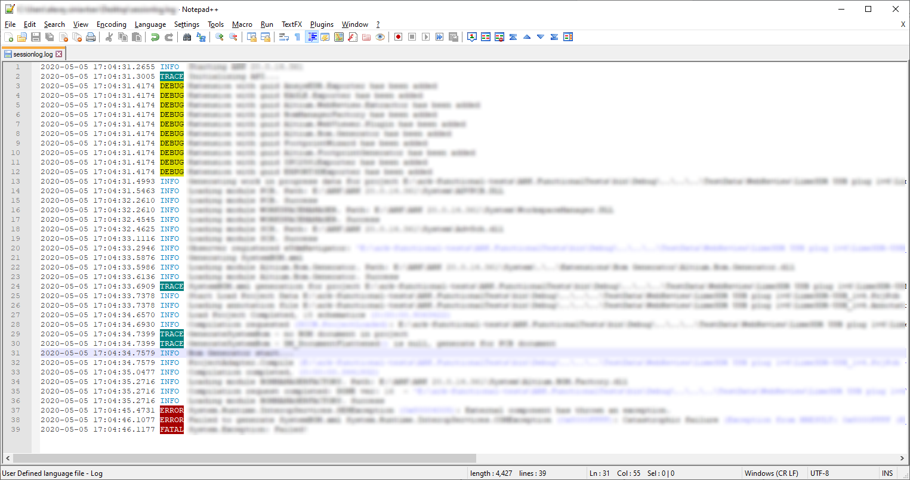

# Logs for Human
Coloring for quickly finding information that you need from log.  
Available for browser and for local Notepad++.
  
## Chrome / Opera / Firefox / Safari Browser

### Usage
1. Install [Tampermonkey](https://www.tampermonkey.net) extension for your browser 
2. Download `logs-for-human.js`
3. In Tampermonkey click `+` to add new script
4. Copy and paste whole sctipt from `logs-for-human.js` to new created Tampermonkey script
5. Add your URL pattern in `@match` row.
6. Save script.  
  
Note: script is unsafe for pages, that are not logs, so can break HTML structure. Try to add pattern, where logs only are located, e.g. `https://your-jenkins/*/console*`
## Notepad++

### Usage
1. Download `npp_language_log.xml`
2. In Notepad++ go to `Language` > `User Defined Language` > `Define your language...` > `Import...`
3. Set `log` to `Ext.:` field to assosicate highlight with `.log` files
