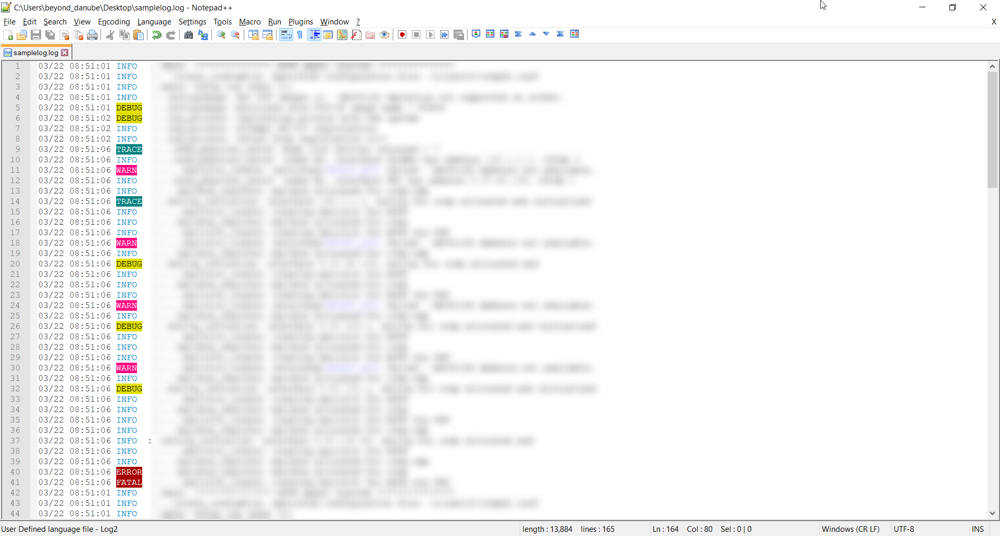

# Notepad++ Logs for Human
Coloring for quickly finding information that you need from log.
  

  
## Usage
1. Download `npp_language_log.xml`
2. In Notepad++ go to `Language` > `User Defined Language` > `Define your language...` > `Import...`
3. Set `log` to `Ext.:` field to assosicate highlight with `.log` files
